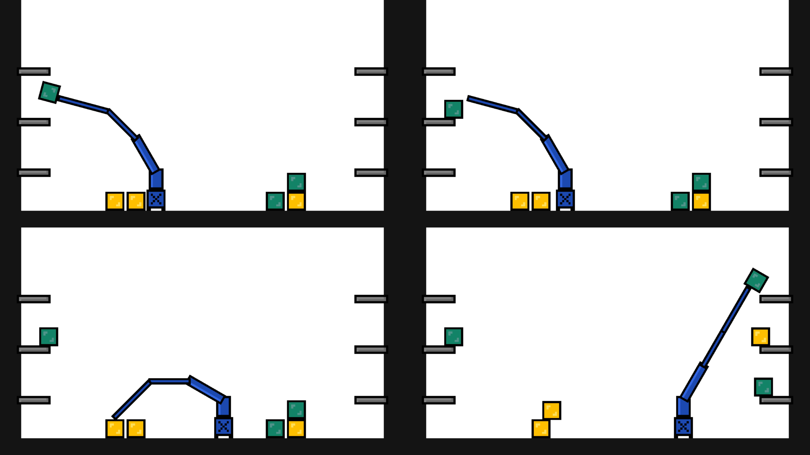

# T1 - Fundamentos de Computação Gráfica - 2019/2

Jogo 2D onde se controla um robô capaz de movimentar caixas pelo cenário (segurar, soltar, colocar em prateleiras). Cenário e personagem são definidos (cores, tamanho, formato) e carregados por meio de um arquivo de texto simples. Controles e física programados com base nos algoritmos estudados durante a cadeira, utilizando a biblioteca OpenGL.

- Comandos:
  - ←/→ : movimenta robô na horizontal
  - Q/W, A/S, Z/X: rotaciona braços do robô
  - Espaço: segura/solta caixa
  - ↑/↓: entra/sai da tela cheia
  - Escape: sai do jogo

Baseado no projeto inicial fornecido pelo Prof. Márcio Sarroglia Pinho.

 

## Requisitos

- [Code::Blocks](https://www.codeblocks.org/)
- Compilador C/C++ (testado com GCC/G++)
- freeglut
  - Windows (Tutorial):
    - https://youtu.be/ek4Jmh0Fuko
  - Debian/Ubuntu (Pacotes):
    - freeglut3-dev
    - libjpeg-dev

Observação: fazer *rebuild* do projeto conforme plataforma onde o mesmo for executado (*Debug-Linux* ou *Debug-Windows*).

## Licença

[MIT](https://choosealicense.com/licenses/mit/)
